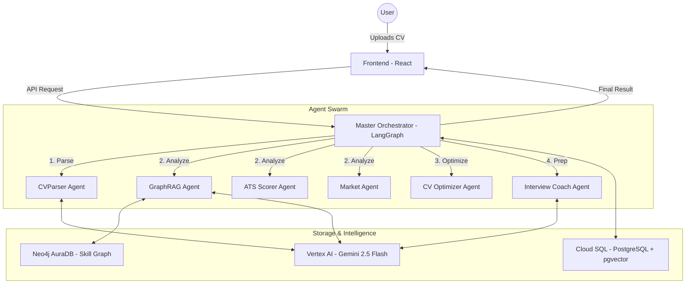

# ⚡ AI Partner for Career Development

An advanced, agentic career development platform that automates the end-to-end journey from profile ingestion to interview preparation. Built with a multi-agent architecture using **LangGraph**, **FastAPI**, and **React** — deployed on **Google Cloud Run**.

> **Live Production**
> - 🌐 Frontend: [ai-career-frontend](https://ai-career-frontend-560579918305.asia-southeast1.run.app)
> - 🔌 Backend API: [ai-career-backend](https://ai-career-backend-560579918305.asia-southeast1.run.app/docs)

---

## 🚀 Quick Start

### Option A: Local Development (Docker)

#### 1. Prerequisites
- [Docker](https://www.docker.com/get-started) installed.
- A **Google Cloud Project** with Vertex AI enabled.

#### 2. Environment Setup
```bash
cp backend/.env.example backend/.env
```
Edit `backend/.env` and configure:
- `GOOGLE_CLOUD_PROJECT` — your GCP project ID
- `GOOGLE_GENAI_USE_VERTEXAI=True`
- `STRIPE_SECRET_KEY` / `STRIPE_WEBHOOK_SECRET` — for payment features

#### 3. Build & Launch
```bash
docker compose up --build
```
Once running:
| Service       | URL                                                         |
| ------------- | ----------------------------------------------------------- |
| Frontend      | [http://localhost:3000](http://localhost:3000)               |
| Backend API   | [http://localhost:8000/docs](http://localhost:8000/docs)     |
| PGAdmin       | [http://localhost:5050](http://localhost:5050)               |
| Neo4j Browser | [http://localhost:7474](http://localhost:7474)               |

#### 4. Seed Data
Populate the system with ESCO skills and job ontologies:
```bash
docker exec -it career_backend python scripts/seed_esco.py
docker exec -it career_backend python scripts/seed_neo4j_skills.py
```

### Option B: Cloud Deployment (Google Cloud Run)

The project is production-deployed on Cloud Run with:
- **Cloud SQL** (PostgreSQL 18 + pgvector) via Cloud SQL Auth Proxy
- **Neo4j AuraDB** for the skill knowledge graph
- **Vertex AI** (Gemini 2.5 Flash) for all LLM inference
- Environment-aware configuration (`APP_ENV=production`) for automatic URL routing

Deploy commands:
```bash
# Backend
gcloud run deploy ai-career-backend --source ./backend \
  --region asia-southeast1 --allow-unauthenticated \
  --add-cloudsql-instances PROJECT:REGION:INSTANCE

# Frontend
gcloud run deploy ai-career-frontend --source ./frontend \
  --region asia-southeast1 --allow-unauthenticated
```

---

## 🧠 Architecture: The "Thin Orchestrator" Pattern

The system uses a multi-agent design where a **Master Orchestrator** (LangGraph state machine) delegates specialized tasks to a swarm of autonomous agents with persistent checkpointing.



---

## ✨ Core Features

- **Multi-Source Ingestion** — Import your professional profile via PDF upload or LinkedIn public URL (Apify-powered scraping).
- **GraphRAG Skill Gap Analysis** — Neo4j-backed ESCO skill ontology finds precise gaps between your profile and target roles.
- **ATS Optimization Engine** — Predicts ATS score and generates a tailored CV version for any job description.
- **AI Interview Coach** — Real-time, voice-capable interview sessions using Vertex AI Multimodal Live API, scored on Relevance, Clarity, and Depth.
- **Career Roadmap** — Visual learning path with recommended resources to bridge identified skill gaps.
- **Privacy-First** — Client-side PII redaction via Web Workers ensures sensitive data never leaves the browser.
- **OAuth Authentication** — Sign in with Google or LinkedIn alongside traditional email/password.
- **Stripe Payments** — Tiered subscription system (Free / Pro / Premium) with webhook-driven status sync.
- **7-Stage Pipeline UX** — Real-time WebSocket progress updates with a multi-stage loading system during AI processing.

---

## 🛠️ Technical Stack

| Layer        | Technologies                                                                    |
| ------------ | ------------------------------------------------------------------------------- |
| **Backend**  | FastAPI, Python 3.11, LangGraph, SQLAlchemy/SQLModel, Alembic, Uvicorn          |
| **Frontend** | React 19, TypeScript, Vite, Tailwind CSS, Framer Motion, Recharts               |
| **AI/ML**    | Vertex AI (Gemini 2.5 Flash), Sentence-Transformers (`all-MiniLM-L6-v2`)        |
| **Databases**| Cloud SQL PostgreSQL 18 + pgvector, Neo4j AuraDB                                |
| **Auth**     | JWT (python-jose), Google OAuth 2.0, LinkedIn OAuth 2.0                         |
| **Payments** | Stripe Checkout + Webhooks                                                      |
| **DevOps**   | Google Cloud Run, Cloud Build, Cloud SQL Auth Proxy, Docker, Nginx, `uv`        |
| **Testing**  | Pytest, Vitest, Playwright (E2E)                                                |

---

## 📁 Project Structure

```
ai-career-partner/
├── backend/
│   ├── app/
│   │   ├── core/           # Config, database, security, logging
│   │   ├── models/         # SQLModel database models
│   │   ├── routers/        # FastAPI route handlers
│   │   ├── orchestrator/   # LangGraph master orchestrator
│   │   ├── services/       # Business logic layer
│   │   └── schemas/        # Pydantic request/response schemas
│   ├── alembic/            # Database migrations
│   ├── scripts/            # Seed scripts (ESCO, Neo4j)
│   ├── Dockerfile
│   └── requirements.txt
├── frontend/
│   ├── src/
│   │   ├── components/     # Reusable UI components
│   │   ├── pages/          # Route pages
│   │   ├── services/       # API client layer
│   │   └── workers/        # Web Workers (PII redaction)
│   ├── Dockerfile
│   └── nginx.conf
├── docker-compose.yml      # Local development stack
└── README.md
```

---

## 📝 Academic Project Information

- **Status**: Production-deployed on Google Cloud Run
- **Author**: Jakshiganj

---

## 📄 License
This project is for academic evaluation purposes only.
