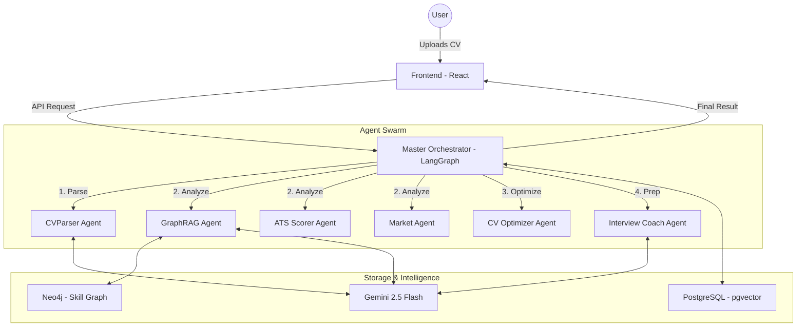

# ⚡ AI Partner for Career Development

An advanced, agentic career development platform that automates the end-to-end journey from profile ingestion to interview preparation. Built with a multi-agent architecture using **LangGraph**, **FastAPI**, and **React**.

---

## 🚀 Quick Start (Docker)

To get the application up and running on your local machine:

### 1. Prerequisites
- [Docker](https://www.docker.com/get-started) installed.
- A **Google Gemini API Key** (Get one at [Google AI Studio](https://aistudio.google.com/)).

### 2. Environment Setup
Clone the repository and create your environment file:
```bash
cp backend/.env.example backend/.env
```
Edit `backend/.env` and add your `GOOGLE_API_KEY`.

### 3. Build & Launch
```bash
docker compose up --build
```
Once the containers are running:
- **Frontend**: [http://localhost:3000](http://localhost:3000)
- **Backend API**: [http://localhost:8000/docs](http://localhost:8000/docs)
- **PGAdmin**: [http://localhost:5050](http://localhost:5050) (User: `admin@admin.com`, Pass: `root`)

### 4. Initialize Data (Seeding)
To populate the system with ESCO skills and job ontologies:
```bash
docker exec -it career_backend python scripts/seed_esco.py
docker exec -it career_backend python scripts/seed_neo4j_skills.py
```

---

## 🧠 Architecture: The "Thin Orchestrator" Pattern

The system utilizes a state-of-the-art multi-agent design where a **Master Orchestrator** delegates specialized tasks to a swarm of autonomous agents.



---

## ✨ Core Features

- **Multi-Source Ingestion**: Import your professional profile via PDF upload or LinkedIn public URL.
- **GraphRAG Skill Gap Analysis**: Uses a Neo4j-backed skill ontology (ESCO) to find precise gaps between your profile and target roles.
- **ATS Optimization Engine**: Predicts your ATS score and generates a version of your CV tailored to a specific job description.
- **AI Interview Coach**: Interactive, voice-capable interview practice sessions that score your responses based on Relevance, Clarity, and Depth.
- **Career Roadmap**: A visual learning path with recommended resources to bridge identified skill gaps.
- **Privacy-First**: Client-side PII redaction ensures sensitive data never leaves your browser unless necessary.

---

## 🛠️ Technical Stack

- **Backend**: FastAPI (Python 3.11+), LangGraph (Orchestration), SQLAlchemy/SQLModel.
- **Frontend**: React (TypeScript), Vite, Tailwind CSS, Framer Motion, Recharts.
- **Databases**: 
  - **PostgreSQL**: Application data & Vector storage (`pgvector`).
  - **Neo4j**: Graph-based skill matching.
- **AI/ML**: Google Gemini 2.5 Flash, Sentence-Transformers (Embeddings).
- **DevOps**: Docker, Nginx.

---

## 📝 Academic Project Information

- **Submission Date**: May 15, 2026
- **Status**: Dockerized & Feature Complete
- **Author**: Jakshiganj

---

## 📄 License
This project is for academic evaluation purposes only.
