# System Design Diagrams
## AI Partner for Career Development

This document contains all UML and architectural diagrams for the final report submission.

---

## 1. System Architecture Diagram

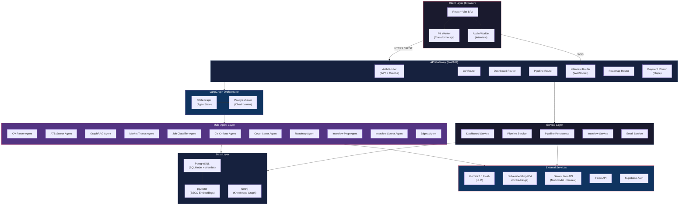

---

## 2. Use Case Diagrams (Modular)

### 2.1 Identity & CV Management
*Focus: Privacy-first ingestion and data protection.*

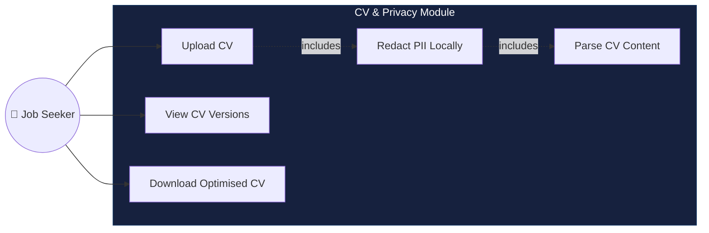

### 2.2 The Intelligent Career Pipeline
*Focus: LangGraph-driven analysis and multi-agent orchestration.*

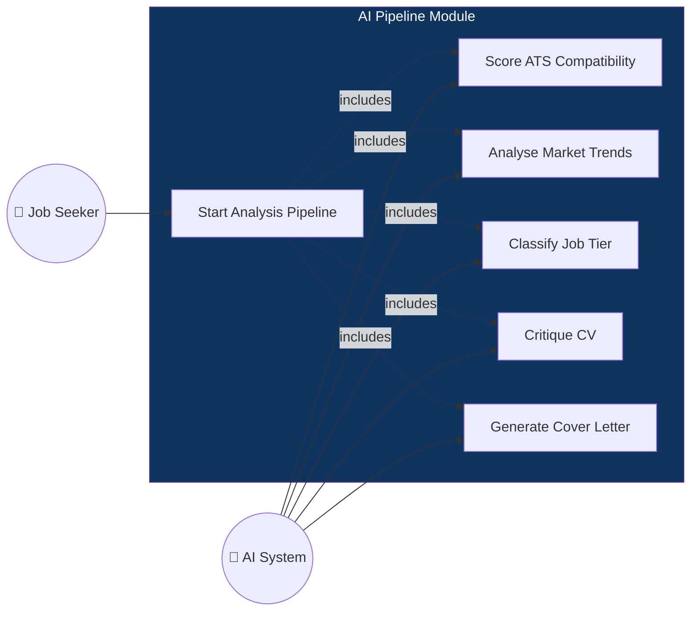

### 2.3 Skill Development & Interviewing
*Focus: Career progression and multimodal practicing.*

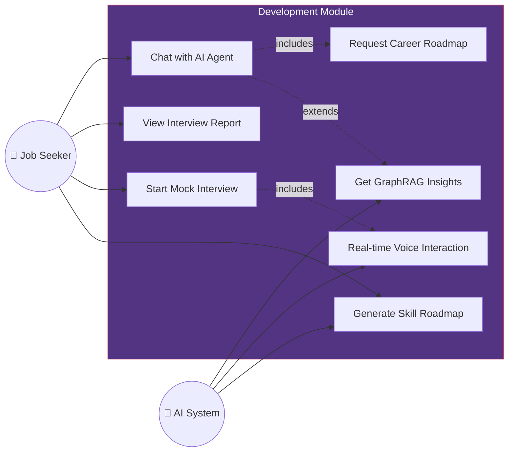

### 2.4 Dashboard & Platform Services
*Focus: Analytics, market insights, and subscription.*

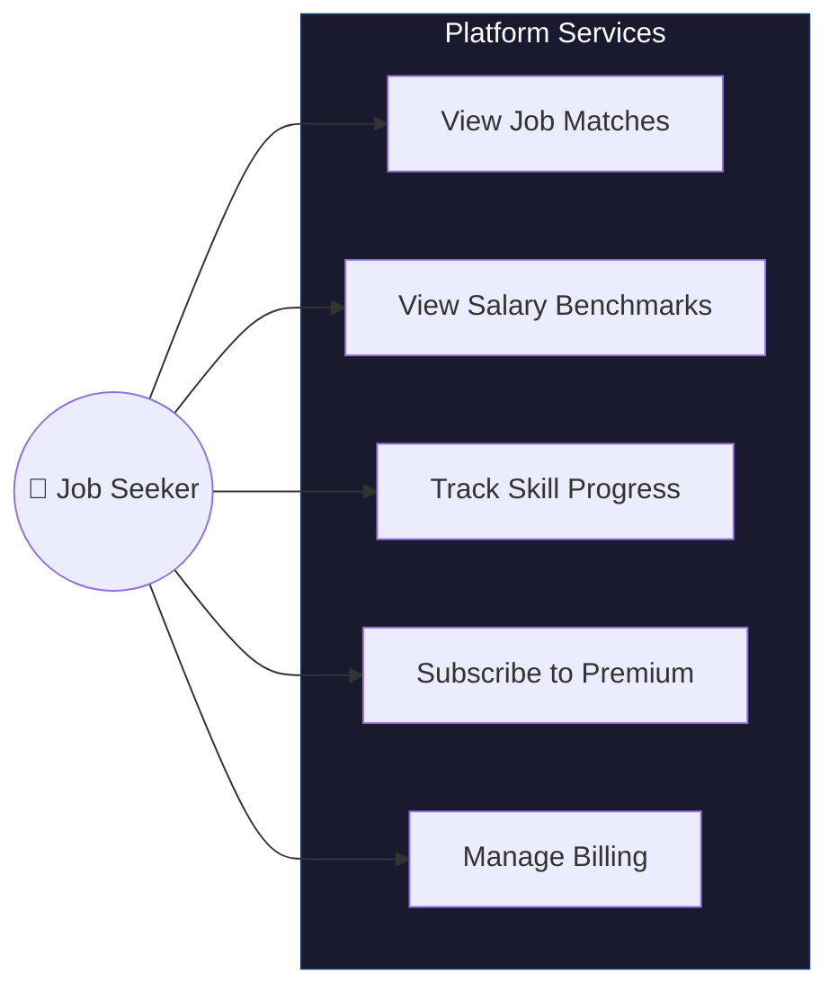

---

## 3. Class Diagram

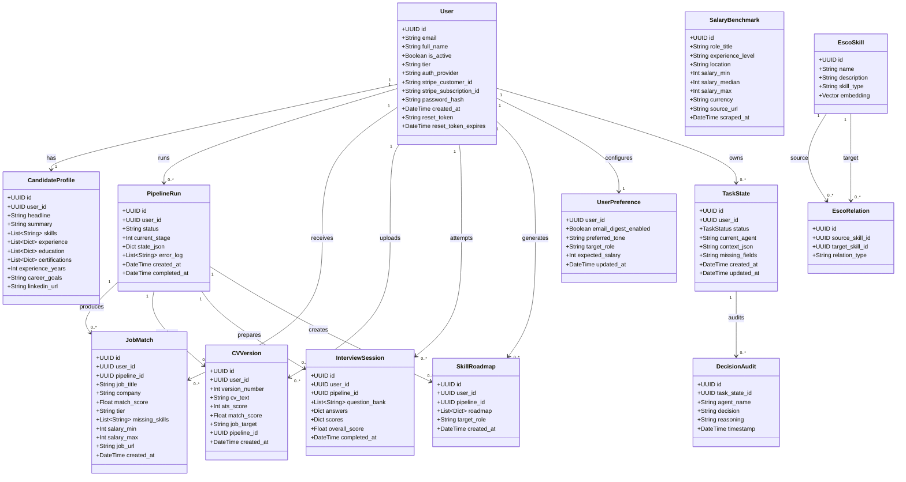

---

## 4. ER Diagram (Entity Relationship)

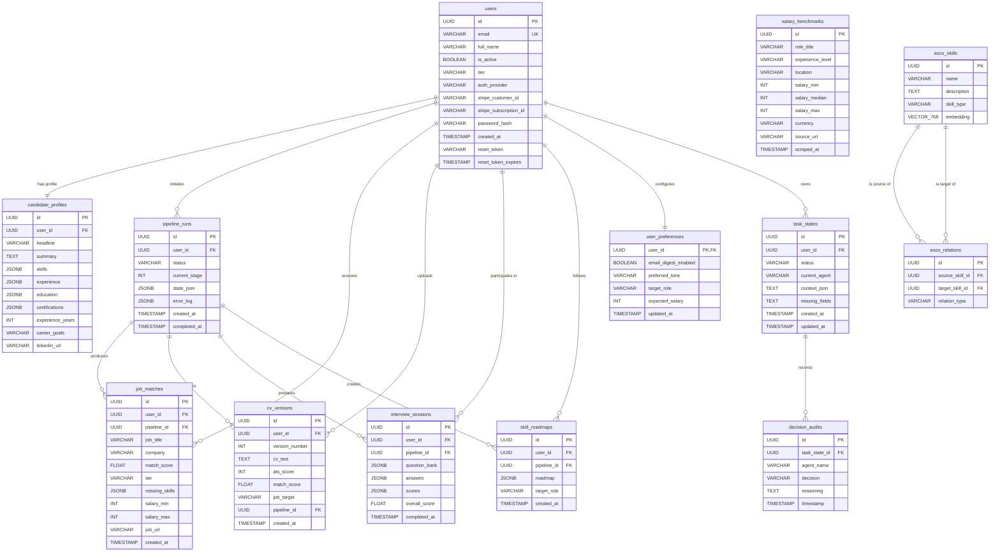

---

## 5. LangGraph Pipeline Flow (Sequence Diagram)

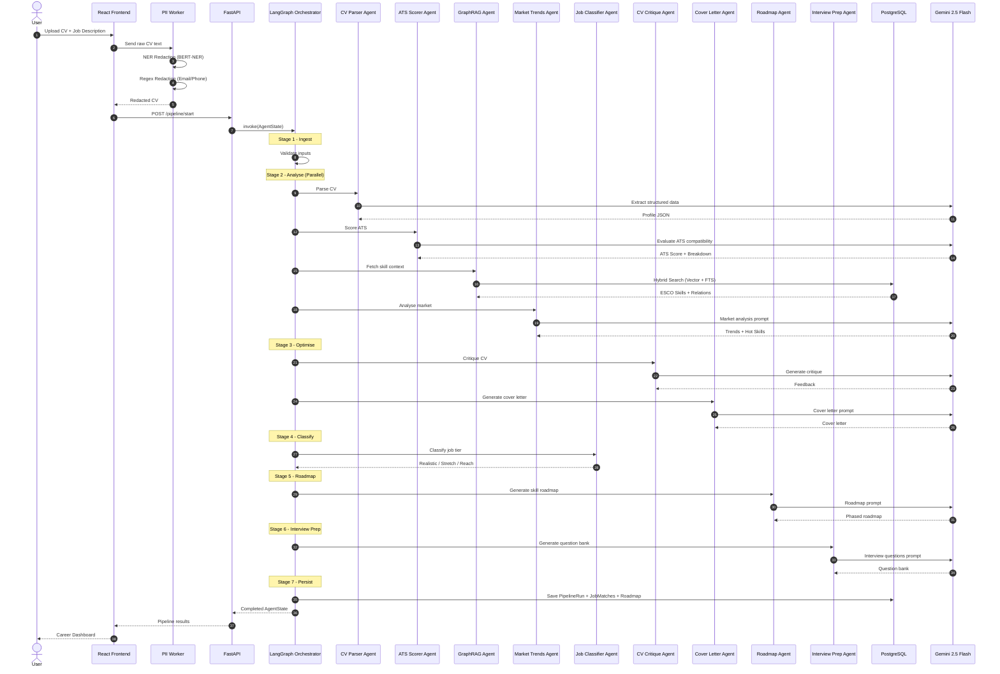

---

## 6. Component Diagram (Frontend)

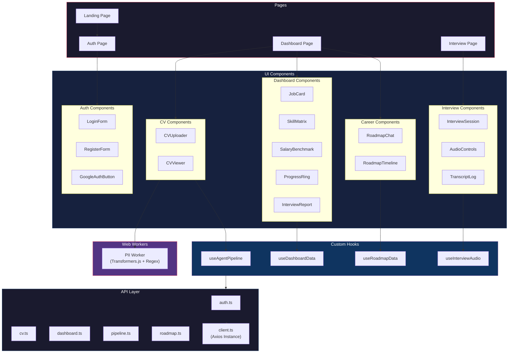

---

## 7. GraphRAG Hybrid Retrieval Flow

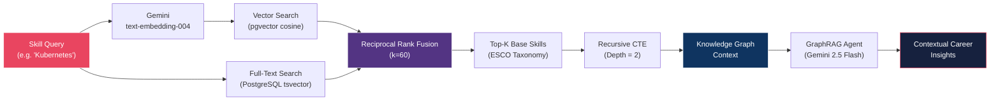

---

## 8. Deployment Diagram

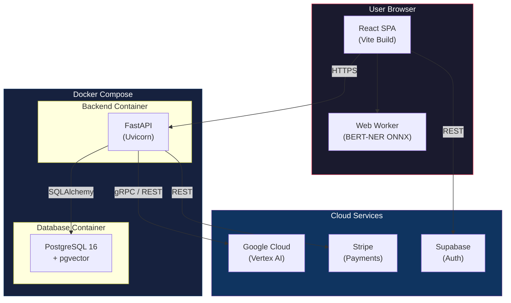

---

*© 2026 AI Career Partner — Final Report Diagrams*
